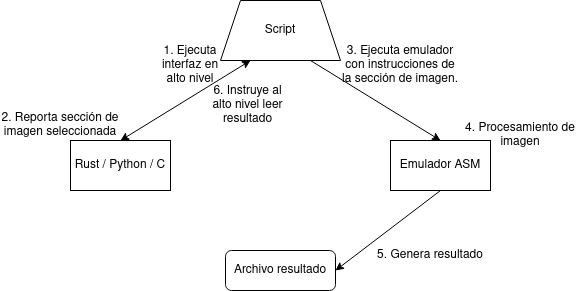
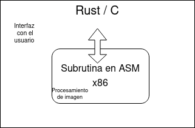

<!-- geometry: "left=1.6cm,right=1.6cm,top=1.6cm,bottom=1.6cm" -->

# Documentación de diseño

## Requerimientos

- Programa en ASM que realice interpolación bilineal sobre un conjunto de pixeles de una imagen blanco y negro.
- Programa en lenguaje de alto nivel para interactuar con el usuario y mostrar la imagen y el resultado.
- Integración entre lenguaje de alto nivel y programa ASM que posiblemente corra en emulador.

## Opciones de solución

### ASM

1. RISC-V: Es un lenguaje que ya manejo bastante bien y con facilidad. Tendría que correrlo en un emulador.
2. x86: Es un lenguaje que no manejo y nunca he utilizado. Puede correr nativamente en mi computador personal.

### Lenguajes alto nivel

1. C: Es muy simple. Se utiliza muy comúnmente para interactuar con código ASM nativo. No tiene un sistema de manejo de dependencias nativo o moderno y ocuparía alguna librería como SDL para mostrar los resultados de imágenes.
2. Rust: Es bastante complejo. No es muy común interactuar con código ASM nativo pero sí tiene las facilidades para hacerlo. Tiene un sistema de manejo de dependencias moderno y muy elegante. De igual forma ocuparía alguna librería para mostrar las imágenes. Una ventaja de este lenguaje que solo aplica por este proyecto ser en un contexto educativo es que me gustaría mucho profundizar mi conocimiento al respecto. También existen muy buenas librerías para interacción de CLI si deseara crear el programa de esa manera.
3. Python: Es sumamente sencillo. Es un buen lenguaje de scripting por lo que bastante fácilmente podría interactuar con herramientas externas para correr ASM en un emulador. Tiene un sistema de manejo de dependencias relativamente moderno y fácil de usar. De igual forma ocuparía alguna librería para mostrar las imágenes. Sumamente fácil crear interfaces de scripting o visuales. Tiene desventaja en el ámbito educativo porque no estoy particularmente interesado en ampliar mi conocimiento de Python y no aprendería realmente nada muy útil del lenguaje realizando este proyecto en él.

### Sistema de integración

1. Scripting: En vez de llamar ASM directamente dentro del código como en C o Rust, podría llamar un emulador que ejecute el código por fuera, lo cual requeriría un shell script o parecido para juntar el programa de alto nivel y el programa ASM. Tiene una ventaja de que es fácil usar cualquiera de las opciones de ensamblador.

{ height=4cm }

2. Código embebido: Si el código ASM está embebido dentro del ejecutable esto requeriría que utilice ASM x86 para correr el código ASM nativamente y utilizar Rust o C que tienen esta capacidad de embeber ASM en su ejecutable. Este método produciría un programa muy eficiente (aunque este no es un objetivo del proyecto) y un solo ejecutable binario que se encargue de todo, sin tener que "pegar" diferentes partes con un script y utilizar un emulador externo. También esta opción tiene una ventaja de este ser un contexto educativo porque sí me interesa aprender cómo sería embeber código ASM en una aplicación real.

{ height=4cm }

### Interfaz con el usuario

1. CLI
2. GUI

### Comparación de opciones

### ASM
En lenguajes de ASM RISC-V tiene casi todas las ventajas porque me parece un lenguaje superior y ya lo conozco. Pero esto último se convierte en una ventaja educativa para x86, porque es de los lenguaje de ASM más utilizados y sería beneficioso para mí conocerlo. Otra ventaja de x86 es que puede ser corrido nativamente en mi máquina personal.

### Lenguajes de alto nivel
C tiene una ventaja educativa de que es el lenguaje más comúnmente utilizado en industrias donde uno suele querer embeber código ASM en una aplicación y sería útil saber cómo hacerlo. Además es un lenguaje muy sencillo de utilizarpara aplicaciones pequeñas como esta. Pero es muy inconveniente el manejo de librerías externas que requiero para este proyecto (principalmente para mostrar las imágenes).

Rust es un lenguaje mucho menos popular pero que está en crecimiento y es muy apto para aplicaciones donde uno posiblemente quiera embeber código ASM, aunque menos que en C. Tiene la desventaja de que es un lenguaje más complejo e interactuar con ASM (con mi conocimiento actual) parece ser más difícil que con C. Una ventaja es que es muy fácil realizar interfaces de CLI y es más fácil realizar interfaces GUI que con C. Otra gran ventaja es que es súmamente sencillo y agradable el manejo de librerías externas.

Python es un lenguaje que no se suele utilizar para interactuar con código ASM. Tiene grandes ventajas como que es súmamente facil y rápido el desarrollo de aplicaciones pequeñas en python como esta y es un lenguaje de scripting muy apto en el caso que se desee utilizar un emulador externo para correr el código ASM. También es muy fácil realizar GUIs en Python y tiene un manejo de librerías externas bastante sencillo y fácil aunque no tan agradable como el de Rust.

### Sistema de integración

El scripting es muy sencillo y abre posibilidades de utilizar emuladores externos entonces podría utilizar cualquiera de las opciones de ASM o lenguaje de alto nivel.
Embeber el código ASM en un ejecutable nos restringe a C o a Rust y a x86 para ASM, pero tiene la gran ventaja de que educativamente me interesa aprender a hacerlo.

### Interfaz con el usuario

Una CLI es viable y relativamente sencilla de implementar en cualquiera de los lenguajes de alto nivel. No tan "elegante" para este proyecto en específico que requiere seleccionar un cuadrante de la imagen.
Una GUI puede ser, dependiendo del sistema de integración y lenguaje de alto nivel seleccionado, bastante más difícil de realizar que una CLI. Es más "elegante" porque se puede visualizar la imagen y el cuadrante que uno desea seleccionar.

## Propuesta final

La propuesta final es utilizar x86 nativo como ASM. Esto significa que voy a embeber el código ASM x86 en un ejecutable que correrá nativamente junto al código de alto nivel. Esta desición fue tomada principalmente por mi interés educativo de aprender cómo es este proceso.

Se utilizará una interfaz gráfica simplemente porque me parece el tipo de interfaz más apta para un programa que realiza las funciones de este programa.

Para el lenguaje de alto nivel se utilizará Rust por sus facilidades de interfaz con el usuario y manejo de librerías externas.
